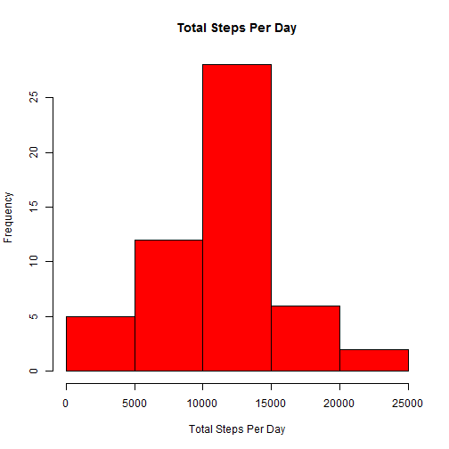
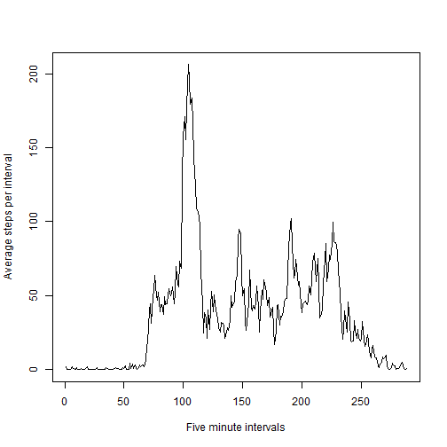
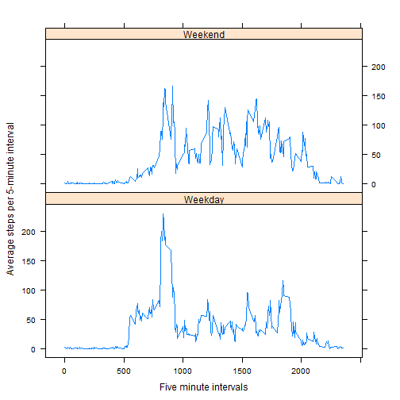

Peer Activity 1 Markdown File
==============================

## Loading and preprocessing the data
- Start by setting the working directory and loading the data.
- Convert the date into a the appropriate date format
- Finally, filter out the missing values and creating a new dataset without the "NA"s, which will be used in the first few steps of the analysis (until the part where missing values are imputed)


```r
setwd("C:/Users/dama/Desktop/r_class/")
raw_data <- read.csv("class_four_data/activity.csv", stringsAsFactors = TRUE,
        row.names = NULL,
        na.strings = "NA",
        col.names = c("steps", "date", "interval"))
raw_data$date <- as.Date(raw_data$date, format = "%Y-%m-%d") 
data <- raw_data[!is.na(raw_data$steps),]
```

        
The data has been loaded and the date has been converted to date format. 

## What is the mean total number of steps taken per day?
Now, perform the following tasks:  

1. Calculate the total number of steps taken per day  
2. Plot a histogram of the total number of steps taken per day  
3. Summarize the total number of steps taken per day, in order to report the mean and median

Note: The first two "options" are due to the mean number showing up as an exponential (fixed by scipen) and with too many decimals (dixed by digits)


```r
total_steps <- aggregate(data$steps, by=list(data$date), FUN = "sum")
hist(total_steps$x, col="red", xlab = "Total Steps Per Day", main = "Total Steps Per Day")
```

 

```r
summary(total_steps$x)
```

```
##    Min. 1st Qu.  Median    Mean 3rd Qu.    Max. 
##      41    8841   10760   10770   13290   21190
```

As seen in the summary table above, the mean total steps per day is 10770 and the median total steps per day is 10760. 

## What is the daily activity pattern?
Two different taks:

1. Calculate the average number of steps per interval (0, 5, etc.). This will show on average how many steps are taken in each interval across all of the observation days (61). Then plot this average, where interval is on the x-axis and the average number of steps is on the y-axis  

2. Then summarize the average steps, find the maximum number and identify which interval is associated with the max. Then display that interval. This is done in the following way:
- Find the maximum average number of steps
- Find the row in the data frame that is associated with the maximum average number of steps (which is the second column)
- Once the row is identified, look at the value in the first column of that row, which is the interval with the maximum average


```r
average_steps <- aggregate(data$steps, by=list(data$interval), FUN = "mean")
plot(average_steps$x, type = "l", ylab = "Average steps per interval", xlab = "Five minute intervals")
```

 

```r
max_average <- max(average_steps$x)
row_with_max_average <- which.max(average_steps[,2])
interval_max <- average_steps[row_with_max_average, 1]
```

The maximum number of steps on average across all intervals is 206.1698113 and the 5-minute interval that contains this maximum number of steps is 835

## Imputing missing values
The process for imputing missing values is as follows:  
1. Calculate the mean number of steps for each 5-minute interval and create a data frame (already done). Rename the variables to make merging easier  
2. Merge this with the original dataset, which contains the missing value  
3. For each missing value, assign the mean of the 5-minute interval that the missing value is in. This is done by replacing the missing values in the "steps" column with the interval mean. This is achieved by using a combination of within() and is.na(). Then subset the resulting data frame to create a "new dataset that is equal to the original dataset but with the missing data filled in" (as defined in the assignment). This simply involves removing the "interval mean" column  
4. Plot the histogram  
5. Calculate the mean and median total steps per day (as above) and show the result.


```r
names(average_steps)[names(average_steps)=="Group.1"] <- "interval"
names(average_steps)[names(average_steps)=="x"] <- "interval_mean"

impute_data <- merge(raw_data, average_steps, by.x = "interval", by.y = "interval")

impute_data <- within(impute_data, steps <- ifelse(is.na(steps), interval_mean, steps))
impute_data <- subset(impute_data, select=c(interval, date, steps))

total_steps_impute <- aggregate(impute_data$steps, by=list(impute_data$date), FUN = "sum")
hist(total_steps_impute$x, col="red", xlab = "Total Steps Per Day (with missing values imputed)", main = "Total Steps Per Day (with missing values imputed)")
```

 

```r
summary(total_steps_impute$x)
```

```
##    Min. 1st Qu.  Median    Mean 3rd Qu.    Max. 
##      41    9819   10770   10770   12810   21190
```

After missing values are imputed by assigning them the average number of steps in their 5-minute interval mean total steps per day remains at 10770, while the median total steps per day becomes 10770. A slight increase in the median, but no change in the mean. This is not surprising, since the missing values occur in certain days (as opposed to some intervals in some days having missing values, perhaps in a random fashion) and hence are evenly distributed across intervals within a day.

## Are there differences in activity patterns between weekdays and weekends?


```r
library(lattice)
impute_data$day_of_week <- weekdays(impute_data$date)
impute_data$type_day <- "Weekday"

impute_data <- within(impute_data, type_day <- ifelse(day_of_week == "Saturday" | day_of_week == "Sunday", "Weekend", "Weekday"))

type_day_average_steps <- aggregate(impute_data$steps, by=list(impute_data$interval, impute_data$type_day), FUN = "mean")

xyplot(type_day_average_steps$x ~ type_day_average_steps$Group.1 | type_day_average_steps$Group.2, t= "l", xlab = "Five minute intervals", ylab = "Average steps per 5-minute interval", layout = c(1,2)) 
```

 

